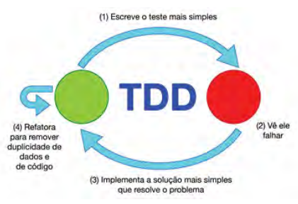

# Testes Automatizados em PHP

Exemplos de testes de unidade feitos na linguagem PHP com a extensão PHPUnit.

## O que é Test-Driven Development (TDD)?

Significa começar a implementação da classe (unidade) pelo teste, prezando sempre por código enxuto e de qualidade.

Isso é também conhecido como o ciclo <b>vermelho-verde-refatora</b>.

## Como fazer?

1. Escreva um teste para um única funcionalidade.

1. Veja o teste falhar.

1. Busque a implementação mais simples para resolver o problema.

1. Melhore (refatore) seu código sempre que necessário.
